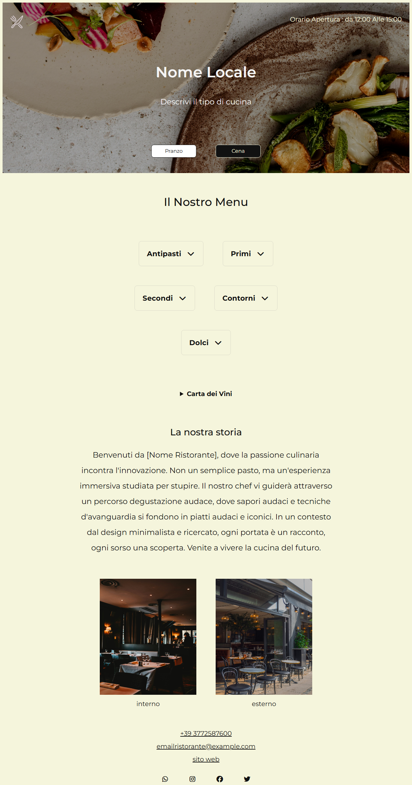

# 🍽️ Restaurant Digital Menu

A responsive digital restaurant menu built with **HTML, CSS and Vanilla JavaScript**.

This project was created as a modern digital flyer that restaurants and food businesses can share through **QR Codes**, **WhatsApp**, **Instagram**, **Facebook**, **X (Twitter)** or any other platform, making their menu easily accessible from any device.

Unlike a traditional PDF menu, this template offers an interactive and responsive experience while remaining lightweight, simple and easy to customize.

---

## 📸 Preview



---

## 🚀 Live Demo

Coming Soon

---

## ✨ Features

- Responsive design
- Lunch / Dinner menu switch
- Dynamic menu rendering with JavaScript
- Animated custom preloader
- Expandable food categories
- Wine list section
- Restaurant presentation section
- Contact information and social links
- Mobile-first approach

---

## 🛠️ Built With

- HTML5
- CSS3
- Vanilla JavaScript
- Git

---

## 💡 Project Idea

The goal of this project is to provide restaurants with a simple and modern marketing tool.

Instead of sharing static PDF menus, businesses can distribute a digital menu through a QR Code or a simple link, making it easy for customers to access the menu from any device.

The menu also supports multiple configurations, making it suitable for:

- Lunch and Dinner menus
- Summer and Winter menus
- Seasonal menus
- Promotional menus

The project focuses on simplicity, usability and accessibility rather than online ordering or complex management systems.

---

## 📚 What I Learned

During the development of this project I improved my knowledge of:

- DOM manipulation
- Dynamic rendering with JavaScript
- Organizing data separately from the interface
- CSS animations
- Responsive layouts
- Code organization and readability
- Git workflow

---

## 🔮 Future Improvements

- Multi-language support
- Improved reservation system
- Greater customization options
- Better WhatsApp booking integration
- Theme customization
- CMS integration for menu management

---

## 📂 Project Structure

```text
Restaurant-Digital-Menu/
│
├── css/
├── img/
├── js/
├── index.html
├── 404.html
├── robots.txt
└── README.md
```

---

## 👨‍💻 Author

**Andres Sanchez**

Frontend Developer

---

## 📄 License

This project was designed as part of my frontend development portfolio to showcase responsive web design, JavaScript programming and modern UI implementation.

Feel free to explore the code and use it as inspiration.